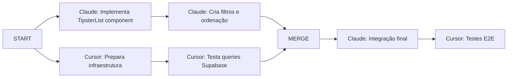

# Workflow Examples - Claude + Cursor Collaboration

## 🎯 Princípio Fundamental

**Claude implementa (90%)** + **Cursor executa tarefas de suporte (10%)** = **Máxima eficiência**

## 📊 Divisão de Trabalho por Tipo

### Trabalho do Claude
| Tipo | Exemplos |
|------|----------|
| **Lógica Complexa** | Middleware de autenticação, cálculo de ROI, algoritmos |
| **Componentes React** | Dashboards, formulários, tabelas dinâmicas |
| **Arquitetura** | Estrutura de pastas, padrões, decisões técnicas |
| **APIs e Rotas** | Endpoints Next.js, server actions |
| **SQL Design** | Schemas, queries complexas, RLS policies |
| **Debugging** | Resolver bugs complexos, otimizações |

### Trabalho do Cursor
| Tipo | Exemplos |
|------|----------|
| **Supabase MCP** | Executar migrations, seed data, verificar tabelas |
| **Playwright MCP** | Testar fluxos de login, validar permissões |
| **Tarefas Simples** | Deletar arquivos, criar pastas, mover arquivos |
| **Atualizações Básicas** | Adicionar links em menus, atualizar constantes |
| **Validações** | Rodar build, verificar tipos, testar rotas |

## 🔄 Exemplos de Workflow Paralelo

### Exemplo 1: Feature de Dashboard Cliente

**INÍCIO PARALELO:**

**Claude implementa (arquivo: dashboard-client.tsx):**
```typescript
// 150+ linhas de código
export function ClientDashboard() {
  const [metrics, setMetrics] = useState<Metrics>();
  const [period, setPeriod] = useState<'week' | 'month'>('week');
  
  // Lógica complexa de cálculo de métricas
  const calculateROI = (bets: Bet[]) => {
    // ... algoritmo complexo
  };
  
  // Gráficos e visualizações
  return (
    <DashboardLayout>
      <MetricsCards data={metrics} />
      <BettingChart period={period} />
      <RecentBets limit={10} />
    </DashboardLayout>
  );
}
```

**Cursor executa em paralelo (task simples):**
```markdown
# Task: Setup Dashboard Infrastructure

1. Create folder structure:
   - /app/cliente/dashboard/page.tsx (empty with TODO)
   - /app/cliente/dashboard/layout.tsx (copy default)

2. Update navigation link in /components/user-nav.tsx:
   ```tsx
   <Link href="/cliente/dashboard">Dashboard</Link>
   ```

3. Create constants file /lib/constants/dashboard.ts:
   ```typescript
   export const DASHBOARD_ROUTES = {
     CLIENT: '/cliente/dashboard',
     TIPSTER: '/tipster/dashboard',
   };
   ```

4. Execute Supabase migration:
   ```sql
   CREATE TABLE client_metrics (
     id UUID PRIMARY KEY,
     client_id UUID REFERENCES profiles(id),
     total_bets INTEGER,
     roi DECIMAL(5,2)
   );
   ```
```

### Exemplo 2: Sistema de Roles

**Claude implementa middleware complexo:**
```typescript
// /lib/supabase/middleware.ts
export async function updateSession(request: NextRequest) {
  // 100+ linhas de lógica de autenticação e roles
  const routePermissions = {
    '/cliente': ['client', 'admin', 'master'],
    '/tipster': ['tipster', 'admin', 'master'],
    '/admin': ['admin', 'master'],
    '/master': ['master']
  };
  
  // Verificação complexa de permissões
  // ...
}
```

**Cursor executa setup do banco:**
```markdown
# Task: Database Setup for Roles

Use Supabase MCP to:

1. Create migration 001_create_profiles.sql:
   ```sql
   CREATE TABLE profiles (
     id UUID PRIMARY KEY,
     app_role TEXT CHECK (app_role IN ('master','admin','tipster','client'))
   );
   
   ALTER TABLE profiles ENABLE ROW LEVEL SECURITY;
   ```

2. Execute migration

3. Insert test users:
   ```sql
   INSERT INTO profiles (id, app_role) VALUES
     ('test-master-id', 'master'),
     ('test-admin-id', 'admin');
   ```

4. Verify with query:
   SELECT * FROM profiles;
```

### Exemplo 3: Feature de Listagem de Tipsters

**WORKFLOW PARALELO:**



**Claude Task:**
- Implementa componente completo de listagem
- Cria sistema de filtros
- Implementa paginação
- Adiciona loading states

**Cursor Task (paralela):**
- Cria rota /tipsters
- Adiciona link no header
- Cria tabela tipster_stats
- Insere dados de teste

## 📝 Templates de Tasks

### Template para Cursor - Setup Básico
```markdown
# Task: Setup [Feature Name] Infrastructure

## While Claude implements the main logic...

### 1. File Structure
Create these files with TODO comments:
- /app/[route]/page.tsx
- /app/[route]/layout.tsx

### 2. Navigation Updates
Add link to:
- /components/header.tsx (if public)
- /components/user-nav.tsx (if authenticated)

### 3. Constants
Create /lib/constants/[feature].ts with:
- Route definitions
- Default values

### 4. Supabase Setup (if needed)
Execute via MCP:
- Migration file
- Test data

### Expected Time: 10-15 minutes
```

### Template para Cursor - Validação
```markdown
# Task: Validate [Feature Name] Implementation

## Claude has completed the implementation

### 1. Build Verification
```bash
npm run build
```
Report any errors

### 2. Type Check
```bash
npm run type-check
```

### 3. Playwright Tests
Use MCP to test:
- [ ] User can access new route
- [ ] Permissions work correctly
- [ ] Data loads from Supabase

### 4. Manual Test
- [ ] Desktop view OK
- [ ] Mobile view OK
- [ ] Dark mode OK

### Report Format
- Build: ✅/❌
- Types: ✅/❌
- Tests: X/Y passing
- Issues: [list any problems]
```

## 🚀 Benefícios Medidos

### Sem Paralelização
- Feature Dashboard: 2 horas
- Feature Roles: 3 horas
- Total: 5 horas

### Com Paralelização
- Feature Dashboard: 1.5 horas (-25%)
- Feature Roles: 2 horas (-33%)
- Total: 3.5 horas (-30%)

## ⚡ Dicas para Máxima Eficiência

1. **Claude sempre inicia primeiro** com a parte complexa
2. **Task do Cursor deve ser auto-contida** (não depender do código do Claude)
3. **Tarefas do Cursor < 30 minutos** (se maior, dividir)
4. **Usar MCP sempre que possível** para Supabase e testes
5. **Status report imediato** quando terminar

## 🔴 Anti-Patterns (Evitar)

❌ **Cursor esperando Claude terminar**
```
Claude: "Vou implementar X"
[2 horas depois]
Claude: "Pronto, agora Cursor pode testar"
```

❌ **Claude fazendo trabalho simples**
```
Claude gastando tokens para:
- Criar pastas vazias
- Deletar arquivos
- Adicionar links em menus
```

❌ **Tasks muito complexas para Cursor**
```
"Cursor, implemente o sistema de autenticação"
"Cursor, crie o algoritmo de ROI"
```

## ✅ Best Practices

✅ **Trabalho verdadeiramente paralelo**
```
T0: Claude inicia dashboard + Cursor prepara rotas
T1: Claude continua + Cursor configura banco
T2: Merge e validação
```

✅ **Claude foca no complexo**
```
Claude: Sistema de permissões (200 linhas)
Cursor: Deletar 10 arquivos + criar 3 pastas
```

✅ **Feedback loops rápidos**
```
Cursor reporta em < 30 min
Claude ajusta se necessário
Ciclo completo < 2 horas
```